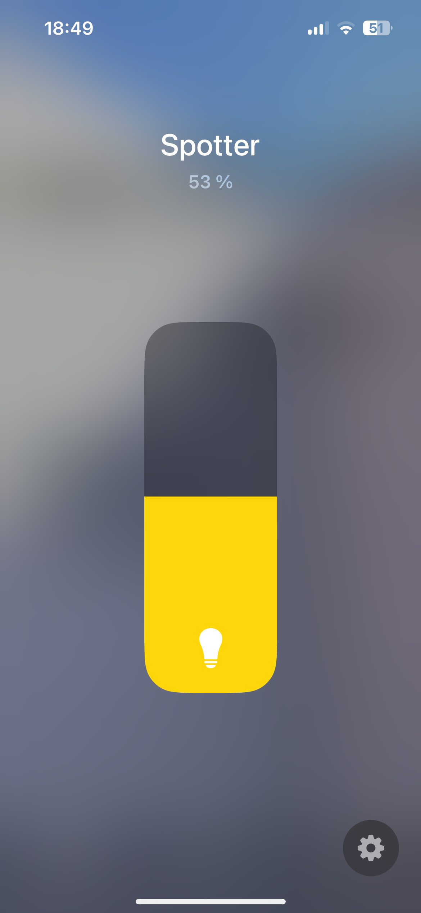
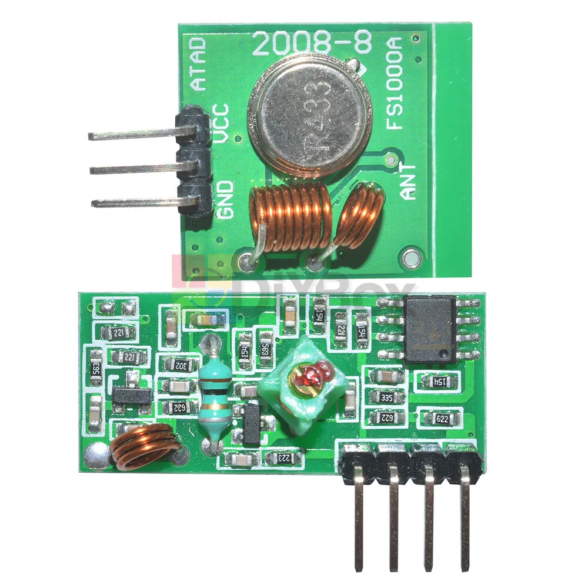
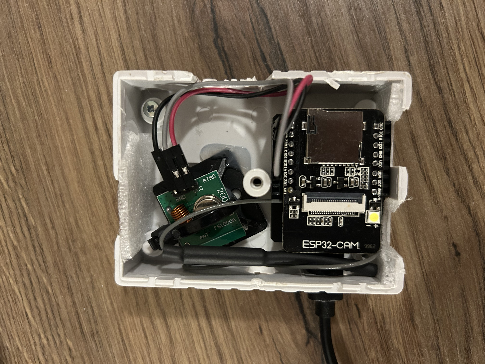

# Home Kit Nexa (433MHz socket) bridge

This simple Nexa Bridge is implemented using [Home Span](https://github.com/HomeSpan/HomeSpan), which simplifies creating HomeKit-compatible accessories on an ESP32.

To communicate with the devices, a 433MHz transmitter is used (e.g., the inexpensive MX-FS-03V). Additionally, a 433MHz receiver is needed to [decode the remote control IDs](/nexa_rf_decoder/) for the remote you wish to replicate in HomeKit. Alternatively, you can generate a random ID, but in this case, you will need to pair the new controller-ID with the socket, as you won’t have a physical remote. This code is only tested on Nexa devices, but might work with similar 433Mhz devices.

<strong>HomeKit dimmable lightswitch</strong> 

<strong>MX-FS-03V and MX-05V Kit used</strong> 

<strong>Assembled</strong> 

